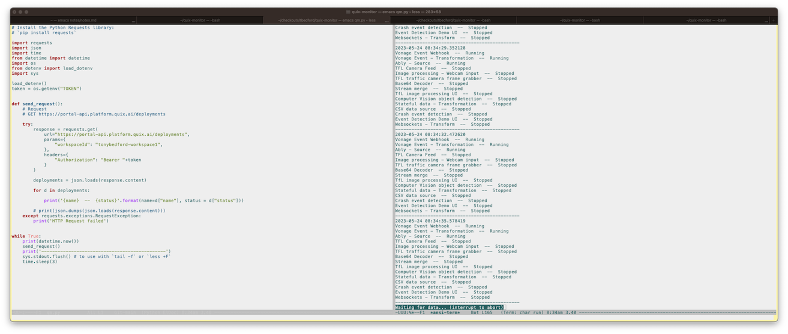

# quix-monitor

A really simple little utility that can monitor your Quix deployments from the command line (or in Emacs). This is only meant as a quick example of using the Portal API, but is surprisingly useful.

Run:

``` shell
python3 qm.py
```

You can also dump to a file:

``` shell
python3 qm.py > dump
```

and monitor in real time with `tail`:

``` shell
tail -f dump
```

or `less`:

``` shell
less +F dump
```

## Use in Emacs

Quite simple to use in Emacs so you can monitor your deployments while getting some work done.

In emacs launch an ANSI term with `M-x ansi-term RET bash` (or Zsh if you want).

Then in the ANSI terminal just type:

1. `python3 qm.py > dump &` - this runs the monitor as a background process.
2. `less +F dump` - this displays the tail of the dump file so you can see your status.

It looks something like this:




## Quix Portal API

This uses the [Quix Portal API](https://quix.io/docs/apis/portal-api.html).

Obviously you can hack this around to improve the UI or display just want you need.

## Authentication

You'll need a bearer token for authentication. You can get this in the Quix Portal. 

1. Log in and click on your account profile pic and select "Tokens". 
2. You can set the longevity of the token. 
3. Then copy it to clipboard using the button provided.

Best use the token through a `.env` file. The `.env` file looks like:

``` text
TOKEN=your-token
```

That's it!

## Free Quix account

You can get a free Quix account by going [here](https://quix.io) and then clicking "Sign Up".

